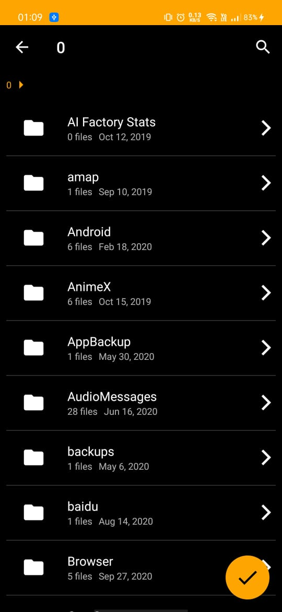
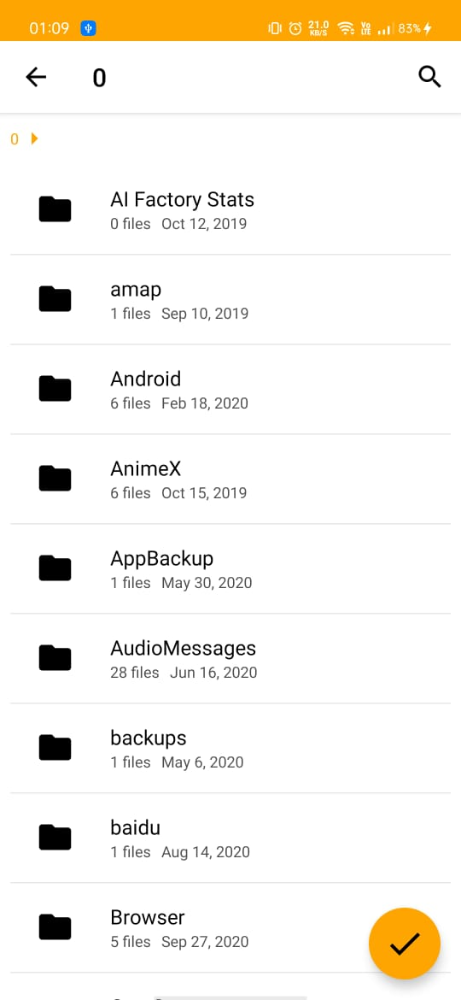
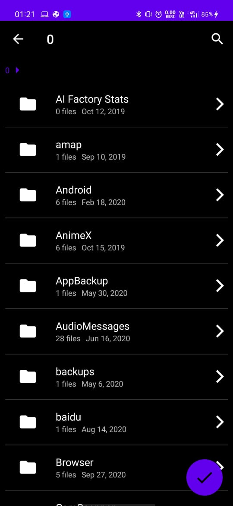

# Unicorn File Picker

[](https://circleci.com/gh/abhishekti7/UnicornFilePicker/tree/master)  [  ] 

Unicorn File Picker is a library designed to package a powerful file selector for android. You can:
 - Start the file picker activity from any activity or fragment
 - Select single or multiple files
 - Use as a Directory Picker
 - Filter out files you want to display
 - Add custom theme or use default theme options (Light & Dracula)
 - And much more which you have to try out for yourself


| Unicorn Dracula                    | Unicorn Default                     | Custom Theme                     |
|:----------------------------------:|:-----------------------------------:|:--------------------------------:|
|  |     | |


## Download
Gradle:

```groovy
repositories {
    maven { url ‘https://jitpack.io’ }
}

dependencies {
    implementation 'com.github.abhishekti7:UnicornFilePicker:$latest_version'
}
```

## How do I use Unicorn File Picker?
#### Permission
The library requires two permissions:
- `android.permission.READ_EXTERNAL_STORAGE`
- `android.permission.WRITE_EXTERNAL_STORAGE`

If you are targeting Android 6.0+, you need to handle runtime permission request before next step.

Also, don't forget to add ``` requestlegacyexternalstorage=true ``` for Android 10.


#### Simple usage snippet
------
Start `UnicornFilePicker` from current `Activity` or `Fragment`:

```java
UnicornFilePicker.from(MainActivity.this)
                    .addConfigBuilder()
                    .selectMultipleFiles(false)
                    .showOnlyDirectory(true)
                    .setRootDirectory(Environment.getExternalStorageDirectory().getAbsolutePath())
                    .showHiddenFiles(false)
                    .setFilters(new String[]{"pdf", "png", "jpg", "jpeg"})
                    .addItemDivider(true)
                    .theme(R.style.UnicornFilePicker_Dracula)
                    .build()
                    .forResult(Constants.REQ_UNICORN_FILE);
```


#### Themes
There are two built-in themes you can use to start `UnicornFilePicker`:
- `R.style.UnicornFilePicker_Default` (light mode)
- `R.style.UnicornFilePicker_Dracula` (dark mode)  

You can also define your own custom theme.


#### Receive Result
In `onActivityResult()` callback of the starting `Activity` or `Fragment`:

```java
List<String> mSelected_files;

@Override
protected void onActivityResult(int requestCode, int resultCode, Intent data) {
    super.onActivityResult(requestCode, resultCode, data);
    if (requestCode == REQUEST_CODE_CHOOSE && resultCode == RESULT_OK) {
        ArrayList<String> files = data.getStringArrayListExtra("filePaths");
        for(String file : files){
            Log.e(TAG, file);
        }
    }
}
```

## Contributing
[UnicornFilePicker is an Open Source Project](https://github.com/abhishekti7/UnicornFilePicker/blob/master/CONTRIBUTING.md)